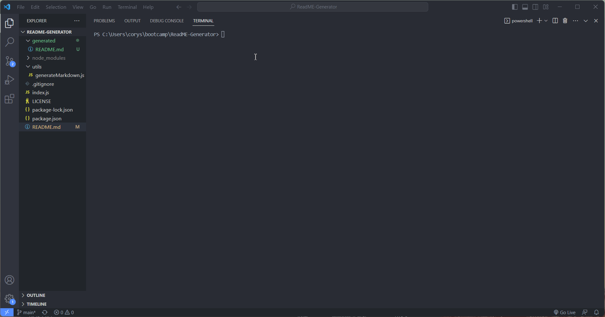

# README Generator
## Created By
   - 
   - Cory 
   - @MacaroniKetchup
## Table of Contents
  - [Description](#description)
  - [Installations](#installations)
  - [Usage](#usage)
  - [Contact-Info](#contact)
  - [Contributions](#contributions)
  - [Testing](#testing)
  
* [License](#license)

## Description
This node.js application is used to generate a README file by running this application in the terminal, answering prompts displayed in the terminal and a README.md file is generated using the answers passed through the prompts that were displayed.
## Installations
Inquirer ver.8.2.4 or higher
## Usage
Installed Inquirer by entering npm install inquirer@8.2.4 in the terminal, once Inquirer is confirmed to be installed, run the node index.js in the terminal to start up the application. Once the application runs you'll answer the given prompts displayed on screen, when the last prompt is answered you receive a message in the terminal that your README is being generated, and then you can find your generated README.md file in a folder titled 'generated'.
## Demo

## Contributors
If you would like to make contributions or edit this code on your own you can fork this project from the repo located on my GitHub profile. Or you can contact me via email, both of these will be located in the bottom of the README file or you can quick access my contact infrom via the table of contents.
## Contact-Info
- Name: Cory
- Email: stylesthestyer@gmail.com
- Github: [MacaroniKetchup](https://github.com/MacaroniKetchup/)
## Testing
```
No tests were written for this project
```
## License

      licensed under the MIT license.